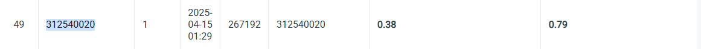

# SelectedTopic25
#ID: 312540020

## Introduction
In this task, I focus on recognizing digits from natural images using the Faster R-CNN model. The dataset includes 30,062 training images, 3,340 validation images, and 13,068 test images. Each image may contain one or more digits, which are often very small and appear in complex backgrounds.
my code is base on git detectron2: https://github.com/facebookresearch/detectron2/tree/main

### 🔹 Key Enhancements:  
- **Anchor size**  
- **giou loss**  
- **Data Augmentation** (ineffective)
- **Focal Loss**  (ineffective)

## Training 
The train.py is the best setting I submit on leaderboard.
```
python train.py
```
The train_aug.py is for augmentation.
```
python train_aug.py
```
The train_focal.py is for apply focal loss.
```
python train_focal.py
```
## Val
To get the pred.csv and pred.json.
```
python pred.py
```
## Performance Snapshot
  
